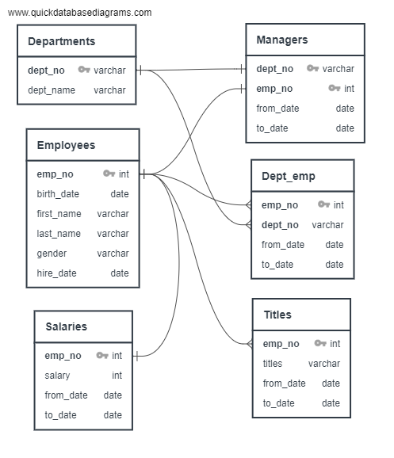
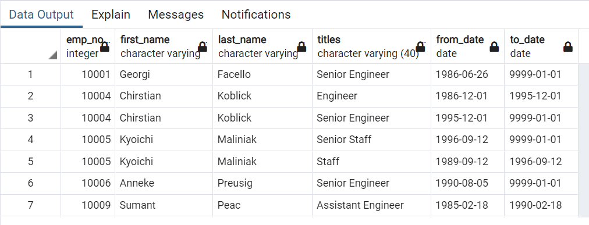
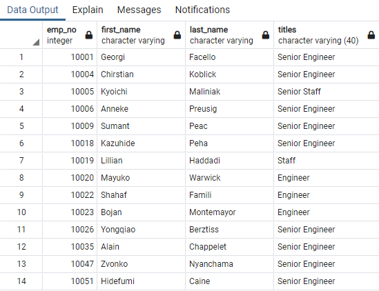
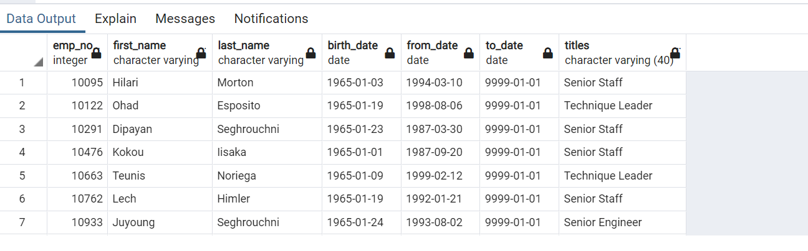
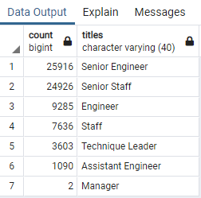
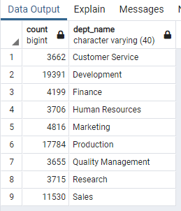
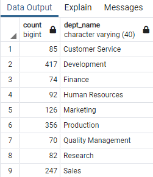

# Pewlett_Hackard_Challenge

## Overview & Purpose

This project has been undertaken on behalf of a company named ‘Pewlett-Hackard’ to help them prepare for the upcoming “Silver Tsunami”. A large number of the current workforce will start to retire in a few years and the company wants to be prepared with the retirement packages ,the number of open positions and training requirements. For the purpose of this analysis, we have calculated the following-

Deliverable 1: The number of retiring employees by their current title

Deliverable 2: The employees who are eligible for the Mentorship Program

Deliverable 3: The number of vacancies per department and the number of mentors available per department

#### Software Used

- QuickDBD to create quick database design
- PostgreSQL for data analysis from relational database
- pgAdmin GUI using SQL language

#### ERD and Schema

An Entity Relationship Digram (ERD) is a type of flowchart that specifies the relationships that can exist between entities. The QuickDBD software has been used to create this flowchart.

## Results

In Deliverable 1, the number of retiring employees have been calculated with their current titles.

- The retirement_titles.csv table is a list of employees born between 1952 and 1955 who are eligible for retirement.

- The unique_titles.csv table is a list of all the current employees of Pewlett-Hackard born between 1952 and 1955 with their most recent titles using the DISTINCT ON function.

- The retiring_titles.csv table counts the number of retiring employees for each title.

- In Deliverable 2, the mentorship_eligibility.csv table lists the number of eligible employees for a Mentorship Program 

From the above analysis, we can find that -

1. 72,458 employees born between 1952 and 1955 will be retiring from Pewlett-Hackard soon.
2. Majority of the employees retiring are Senior Engineers (25,916) and Senior Staff (24,926).Therefore there will be many open positions for Senior Engineers and Senior Staff.

4. Only current employees born in 1965 are eligible for a Mentorship Program.
5. 1,549 employees are currently eligible to take part in the Mentorship Program.

## Summary

1.	72,458 rolls will need to be filled as the “silver tsunami” begins to make an impact.
2.	Overall, 1549 qualified, retirement-ready employees are available to mentor the next generation of Pewlett Hackard employees.
3.	Further analysis shows that the maximum number of retirements are set to happen in Development and Production departments.

4. Also, in terms of the number of mentors available, further analysis shows that the Development department has the highest number of mentors (417) while Quality Management department has the least number of mentors (70).

Therefore, one mentor will need to train approximately 

